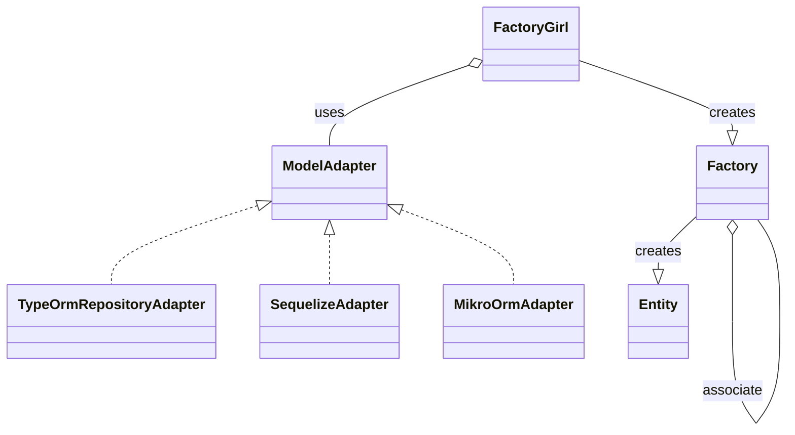
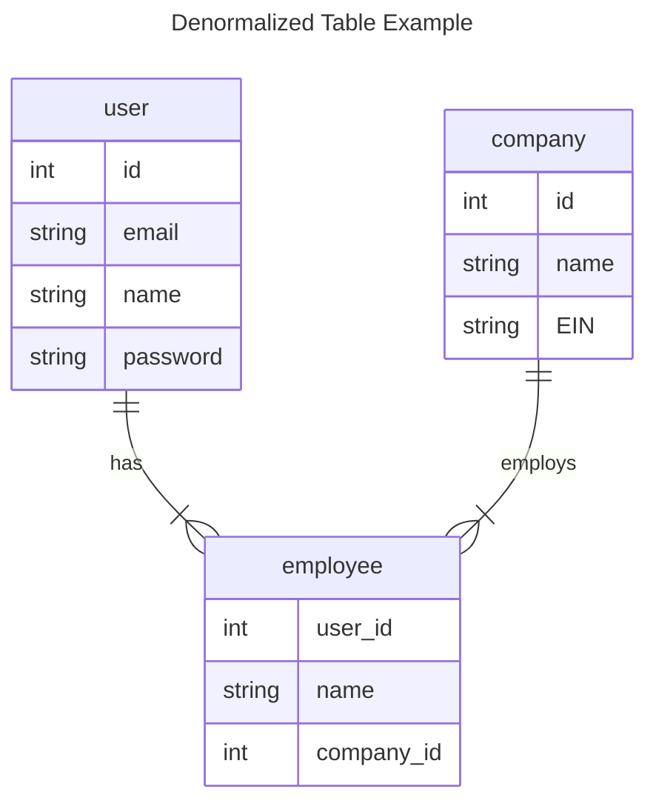

[](https://github.com/thiagomini/factory-girl-ts/actions/workflows/node.js.yml)

# Factory Girl TypeScript (factory-girl-ts)

`factory-girl-ts` is a modern, easy-to-use library for creating test data in Typescript projects. Drawing inspiration from the [factory_bot](https://github.com/thoughtbot/factory_bot) Ruby gem and the [fishery](https://github.com/thoughtbot/fishery) library, `factory-girl-ts` is designed for seamless integration with popular ORMs like [Sequelize](https://sequelize.org/) and [Typeorm](https://typeorm.io/).

## Why `factory-girl-ts`?

While [factory-girl](https://www.npmjs.com/package/factory-girl) is a renowned library for creating test data in Node.js, it hasn't been updated since 2018. `factory-girl-ts` was born to fulfill the need for an updated, TypeScript-compatible library focusing on ease of use, especially when it comes to creating associations and asynchronous operations.

## TL;DR

`factory-girl-ts` is a TypeScript-compatible library created for crafting test data. It is designed to fit smoothly with ORMs such as [Sequelize](https://sequelize.org/) and [TypeORM](https://typeorm.io/).

Key features of `factory-girl-ts` include:

- **A Simple and Intuitive API**: This library makes the defining and creating of test data simple and quick.
- **Seamless ORM Integration**: It has been designed to integrate effortlessly with Sequelize and TypeORM.
- **Built-in Support for Associations**: It allows for simple creation of models with associations, making it perfect for complex data structures.
- **Repository and Active Record Pattern Compatibility**: Depending on your project's requirements, you can choose the most suitable pattern.

`factory-girl-ts` uses an instance of the Factory class to define factories. The Factory class offers several methods for building and creating instances of your models. You can create single or multiple instances, with or without custom attributes, and the library also supports creating instances with associations.

It also allows you to specify an adapter for your ORM, and currently supports four adapters:

- `TypeOrmRepositoryAdapter`
- `SequelizeAdapter`
- `MikroOrmAdapter`
- `ObjectAdapter`

Here's a simple class diagram showing how the main pieces of the library fit together:



## Getting Started

Install `factory-girl-ts` using npm:

```bash
npm install factory-girl-ts
```

## How to Use factory-girl-ts

Factories in factory-girl-ts are instances of the Factory class, offering several methods for building and creating instances of your models.

- `async build(override?)`: builds the target object, with an optional `override` parameter
- `async buildMany(override?)`: builds an array of the target object
- `async create(override)`: creates an instance of the target object in the database
- `async createMany(override)`: creates an array of instances of the target object in the database

Let's see how to define a factory and use each of the methods above

### Defining a Factory (Sequelize Example)

```ts
import { User } from './models/user';
import { FactoryGirl, SequelizeAdapter } from 'factory-girl-ts';

// Step 1: Specify the adapter for your ORM.
FactoryGirl.setAdapter(new SequelizeAdapter());

// Step 2: Define your factory with default attributes for the model.
const defaultAttributesFactory = () => ({
  name: 'John',
  email: 'some-email@mail.com',
  address: {
    state: 'Some state',
    country: 'Some country',
  },
});
const userFactory = FactoryGirl.define(User, defaultAttributesFactory);

// Step 3: Use the factory to create instances of the model.
const defaultUser = await userFactory.build();
console.log(defaultUser);
// Output: { name: 'John', email: 'some-email@mail.com', state: 'Some state', country: 'Some country' }
```

#### Sequences

Instead of providing a hardcoded value, we can tell `factory-girl-ts` to use a sequence.
The first parameter is an unique id. It can be used for sharing sequence across multiple factories.
The second parameter is a callback that gives you an integer auto-incremented that you can use to build your value.

```ts
import { User } from './models/user';
import { FactoryGirl, SequelizeAdapter } from 'factory-girl-ts';

// Step 1: Specify the adapter for your ORM.
FactoryGirl.setAdapter(new SequelizeAdapter());

// Step 2: Define your factory with default attributes for the model.
const defaultAttributesFactory = () => ({
  name: 'John',
  email: FactoryGirl.sequence<string>(
    'user.email',
    (n: number) => `some-email-${n}@mail.com`,
  ),
  address: {
    state: 'Some state',
    country: 'Some country',
  },
});
const userFactory = FactoryGirl.define(User, defaultAttributesFactory);

// Step 3: Use the factory to create instances of the model.
const defaultUser = await userFactory.build();
console.log(defaultUser);
// Output: { name: 'John', email: 'some-email-1@mail.com', state: 'Some state', country: 'Some country' }
const defaultUser2 = await userFactory.build();
console.log(defaultUser2);
// Output: { name: 'John', email: 'some-email-2@mail.com', state: 'Some state', country: 'Some country' }
const defaultUser3 = await userFactory.build();
console.log(defaultUser3);
// Output: { name: 'John', email: 'some-email-3@mail.com', state: 'Some state', country: 'Some country' }
```

### Overriding Default Properties

You can override default properties when creating a model instance:

```ts
const userWithCustomName = await userFactory.build({ name: 'Jane' });
console.log(userWithCustomName);
// Output: { name: 'Jane', email: 'some-email@mail.com', 'Some state', country: 'Some country' }

// Overriding nested properties:
const userWithCustomAddress = await userFactory.build({
  address: { state: 'Another state' },
});
console.log(userWithCustomAddress);
// Output: { name: 'John', email: 'some-email@mail', state: 'Another state', country: 'Some country' }
```

### Building Multiple Instances with `buildMany()`

The `buildMany()` function enables you to create multiple instances of a model at once. Let's walk through an example of how to use it.

```ts
import { User } from './models/user';
import { FactoryGirl, SequelizeAdapter } from 'factory-girl-ts';

// 1. Set the adapter for your ORM.
FactoryGirl.setAdapter(new SequelizeAdapter());

// 2. Define your factory with default attributes for the model.
const defaultAttributesFactory = () => ({
  name: 'John',
  email: 'some-email@mail.com',
});
const userFactory = FactoryGirl.define(User, defaultAttributesFactory);

// 3. Create multiple instances of the model.
const users = await userFactory.buildMany(2);
console.log(users);
// Output: [ { name: 'John', email: 'some-email@mail.com' }, { name: 'John', email: 'some-email@mail.com' } ]
```

#### Overriding Default Attributes for Multiple Instances

buildMany() also allows you to override default attributes for each created instance:

```ts
// Create multiple instances with custom attributes.
const [jane, mary] = await userFactory.buildMany(
  2,
  { name: 'Jane' },
  { name: 'Mary' },
);
console.log(jane.name); // Output: 'Jane'
console.log(mary.name); // Output: 'Mary'
```

#### Applying the Same Override to All Instances

If you want to apply the same override to all instances, you can do that too:

```ts
// Create multiple instances with the same custom attribute.
const [user1, user2] = await userFactory.buildMany(2, { name: 'Foo' });
console.log(user1.name); // Output: 'Foo'
console.log(user2.name); // Output: 'Foo'
```

By using buildMany(), you can efficiently create multiple model instances for your tests, with the flexibility to customize their attributes as needed.

### Creating Instances with `create()`

The `create()` function allows you to create an instance of a model and save it to the database. Let's walk through an example of how to use it.

```ts
import { User } from './models/user';
import { FactoryGirl, SequelizeAdapter } from 'factory-girl-ts';

// Step 1: Specify the adapter for your ORM.
FactoryGirl.setAdapter(new SequelizeAdapter());

// Step 2: Define your factory with default attributes for the model.
const defaultAttributesFactory = () => ({
  name: 'John',
  email: 'some-email@mail.com',
  address: {
    state: 'Some state',
    country: 'Some country',
  },
});
const userFactory = FactoryGirl.define(User, defaultAttributesFactory);

// Step 3: Use the factory to create instances of the model.
const defaultUser = await userFactory.create();

// The factory returns a sequelize instance of the given model. Therefore, we can use sequelize's methods:
console.log(defaultUser.get('name')); // Output: 'John'
```

You can also override default properties and create many instances of the model at once, just like with `build()` and `buildMany()`:

```ts
// Create an instance with custom attributes.
const userWithCustomName = await userFactory.create({ name: 'Jane' });
console.log(userWithCustomName.get('name')); // Output: 'Jane'

// Create multiple instances with custom attributes.
const [jane, mary] = await userFactory.createMany(
  2,
  { name: 'Jane' },
  { name: 'Mary' },
);
console.log(jane.get('name')); // Output: 'Jane'
console.log(mary.get('name')); // Output: 'Mary'

// Create multiple instances with the same custom attribute.
const [user1, user2] = await userFactory.createMany(2, { name: 'Foo' });
console.log(user1.get('name')); // Output: 'Foo'
console.log(user2.get('name')); // Output: 'Foo'
```

### Working with Associations

#### Associate

`factory-girl-ts` provides an easy way to create associations between models using the `associate()` method. This method links a model to another by using an attribute from the associated model.

Let's walk through an example to demonstrate how this works. We'll be using a `User` model and an `Address` model, where each user has one address.

```ts
// Define the User factory.
const defaultAttributesFactory = () => ({
  id: 1,
  name: 'John',
  email: 'some-email@mail.com',
});

const userFactory = FactoryGirl.define(User, defaultAttributesFactory);

// Define the Address factory, associating it with the User factory.
const addressFactory = FactoryGirl.define(Address, () => ({
  id: 1,
  street: '123 Fake St.',
  city: 'Springfield',
  state: 'IL',
  zip: '90210',
  userId: userFactory.associate('id'), // Associates the 'id' from the User model.
}));

const address = addressFactory.build();
const addressInDatabase = await addressFactory.create();

address.get('userId'); // Output: 1
addressInDatabase.get('userId'); // Output: 1
```

The `associate()` function coordinates with the method called in the parent factory. If you call `build()` on the parent factory, `associate()` will trigger the associated factory's `build()` method. Conversely, if you call `create()`, it will invoke the `create()` method in the associated factory.

Additionally, `associate()` allows you to specify a custom attribute (or 'key') for associating the models.

```ts
// Define the Address factory using a custom 'key' to associate with the User factory.
const addressFactory = FactoryGirl.define(Address, () => ({
  id: 1,
  street: '123 Fake St.',
  city: 'Springfield',
  state: 'IL',
  zip: '90210',
  userId: userFactory.associate('uuid'), // Uses the 'uuid' attribute from the User model for association.
}));
```

Lastly, the `associate()` method can also define custom attributes for the associated model.

```ts
const addressForCompanyUserFactory = FactoryGirl.define(Address, () => ({
  id: 1,
  street: '123 Fake St.',
  city: 'Springfield',
  state: 'IL',
  zip: '90210',
  userId: userFactory.associate('id', {
    email: 'john@company.com', // This will create a user with the specified email.
  }),
}));
```

```ts
const addressForCompanyUserFactory = FactoryGirl.define(Address, () => ({
  id: 1,
  street: '123 Fake St.',
  city: 'Springfield',
  state: 'IL',
  zip: '90210',
  user: userFactory.associate(
    {},
    {
      companyName: 'ACME', // This will create a user passing the "companyName" transient parameter. That parameter may be used by the user factory to alter the user's email for instance.
    },
  ),
}));
```

Keep in mind `associate` only comes into play if no value is provided for the given association. This prevents unnecessary creation of entities and can be particularly useful when you want to control the associated value.

```ts
// Create an Address instance with a specified 'userId'. This will bypass the 'associate()' method in the User factory.
const addressFromFirstUser = await addressFactory.create({
  userId: 1,
});
```

#### Associate Many

We can use the `associateMany(count, override, transientParams)` version to associate many instances of a model to another. This is useful when we have a `one-to-many` relationship between two models.

Let's walk through an example to demonstrate how this works. We'll be using a `User` model and a `Profile` model, where each user has many profiles.

```ts
// Define the Profile Factory
const profileFactory = FactoryGirl.define(Profile, () => ({
  phone: '000000000',
  imageUri: 'http://some-image-uri.com',
}));

// Define the User Factory, associating it with the Profile Factory.
const userFactory = FactoryGirl.define(User, () => ({
  id: 1,
  name: 'John',
  profiles: profileFactory.associateMany(2, { phone: '123456789' }),
}));

// Create a User instance with two associated Profiles.
const user = await userFactory.create();
console.log(user.profiles); // Output: [ { phone: '123456789', imageUri: 'http://some-image-uri.com' }, { phone: '123456789', imageUri: 'http://some-image-uri.com' } ]
```

### Extending Factories

You can extend a factory by using the `extend()` method. This allows you to create a new factory that inherits the attributes of the parent factory, while also adding new attributes.

```ts
const companyEmailUser = userFactory.extend(() => ({
  email: 'user@company.com',
}));

const user = await companyEmailUser.build();
console.log(user.email); // Output: 'user@company'
```

You can also use an async callback when extending a factory. This might be useful when the extended factory relies on async resources:

```ts
const companyEmailUser = userFactory.extend(async () => ({
  email: await getEmailFromSomeAsyncResource(),
}));

const user = await companyEmailUser.create();
console.log(user.email); // Output: 'async.email@company.com'
```

#### Extending Factories with reused Associations

There are scenarios where a child factory has more than one attribute that depends on another factory - this is common when we have non-normalized tables. Check out the example below:



In this diagram:

- `user` has a `one-to-many` relationship with `employee` using `user.id` and `employee.user_id`.

- `company` has a `one-to-many` relationship with `employee` using `company.id` and `employee.company_id`.

In order to create an employee factory, we must make sure the `user_id` and `email` belong to the same user. We can leverage the `association.get()` method to do so:

```ts
const employeeFactory = FactoryGirl.define(Employee, () => {
  const userAssociation = userFactory.associate('id');

  return {
    name: userAssociation.get('name'),
    userId: userAssociation.get('id'),
    companyId: companyFactory.associate('id'),
  };
});

const employee = await employeeFactory.create();
```

The strategy above is helpful ensure the data consistency - the employee name will always be the same as the `user` name.

### Factory Hooks

You can also define hooks to run after creating an instance. This might be handy when there is custom logic or async logic to be executed. We have two types of hooks:

- `afterBuild()`: runs after `build()` is called.
- `afterCreate()`: runs after `create()` is called.

```ts
const adminUserFactory = userFactory.afterCreate((user) => {
  const userRole = await userRoleFactory.create({
    userId: user.id,
    role: 'admin',
  });
  user.userRole = userRole;
  return user;
});
```

Both hooks return a brand new factory, so you can chain as many hooks as you want. Moreover, these hook requires that the input model (in the example above, a `User`) is returned.

### Mutating the Model

It's possible to change the return type of a Factory using the `mutate()` method. The `mutate()` method returns a new factory that alters the return type of the original factory:

```ts
const employeeFactory = userFactory.mutate(
  Employee,
  (user) => new Employee(user.id, user.name),
);
```

That method is useful when you have an entity that is based on a parent entity table, but has a different class / behavior. This is common when you have the same table representing two entities from different [bounded contexts](https://martinfowler.com/bliki/BoundedContext.html).

### Conclusion

In summary, `factory-girl-ts` allows you to handle model associations seamlessly. The `associate()` method is a powerful tool that helps you link models together using their attributes, making it easier than ever to create complex data structures for your tests.

Stay tuned for more features and improvements. We are continuously working to make `factory-girl-ts` the most intuitive and efficient tool for generating test data in TypeScript!
